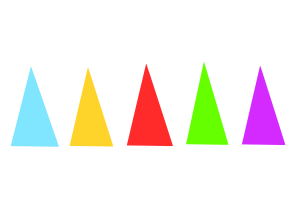

# Mana a Mana
a party game for kids

## Index
<ul>
<li><a href="#mana-a-mana" title="Mana a Mana" smoothhashscroll="">Mana-a-Mana</a><ul>
<li><a href="#index" title="Index" smoothhashscroll="">Index</a>
<li><a href="#requirements" title="Requirements" smoothhashscroll="">Requirements</a><ul>
<li><a href="#to-build-the-extra-material" title="to build the extra material" smoothhashscroll="">to build the extra material</a></li>
<li><a href="#during-the-game" title="during the game" smoothhashscroll="">during the game</a></li>
</ul>
</li>
<li><a href="#two-vs-four-factions-variant" title="Two vs four-factions variant" smoothhashscroll="">Two vs four-factions variant</a></li>
<li><a href="#preparation" title="Preparation" smoothhashscroll="">Preparation</a></li>
<li><a href="#goal-of-the-game" title="Goal of the game" smoothhashscroll="">Goal of the game</a></li>
<li><a href="#how-to-play" title="How to play" smoothhashscroll="">How to play</a><ul>
<li><a href="#setup" title="setup" smoothhashscroll="">setup</a></li>
<li><a href="#rounds" title="rounds" smoothhashscroll="">rounds</a></li>
</ul>
</li>
</ul>
</li>
</ul>

## Requirements
this game only requires poker cards and easy-to-craft *extra material*, it can be played indoor, outside, standing or sitting and it allows for up to 52 active players.

> **note**: for the sake of inclusiveness, this game may be unfit for a scenario in which there are kids with certain disabilities (such as missing/malformed hands or colorblindness), unless, of course, measures to allow every kid to play on the same level are taken.

### to build the extra material

#### minimal
1. at least one hour of time;
2. paper of five different colors;
3. scissors;
4. tape;

#### ideal
5. paint of the same five colors;
6. ten (or twenty) heavy stones to be used to prevent cards from flying\*.

\*especially if playing outside, but also good for indoors.

### during the game

#### minimal
1. one (or two) deck(s) of poker cards;
2. two (or four) separate tables\*;
5. two (or four) adults as *game masters*;
6. a dozen of kids as *players*;

#### ideal
5. another dozen of kids as *players*;
6. five non-playing kids/adults as *mana mages*.

\*if playing while standing, small garden tables are enough.

## two vs four-factions variant
|# of factions| 2 | 4 |
|-------------|---|---|
|# of poker decks required| 1 | 2
|# of players|10 - 26|20 - 52|
|suits for kids| ♥♠ | ♥♦♠♣ |
|suits for tables| ♦♣ | ♥♦♠♣ |

## Preparation

#### minimal
1. cut the paper in small, short stripes to be folded into small finger-size cones, fixed in place with tape and in number greater or equal to the number of kids times five\*;

#### ideal
2. with the same approach of (1), assemble five big cones to be worn as hats by the five non-playing kids/adults;
3. paint the stones so to have five of every color for each table.

\*each kid should be able to hold all five different cones on the fingers of an hand at the same time.

## goal of the game
each faction tries to be the first one to have all its members to aquire all five different *mana*. mana is represented by the small paper cones of the corresponding color, to be worn as finger-hats on the fingers of one hand.

## How to play

### setup

#### 1. remove unused cards
take all the cards with numbers up to the number of player per faction\*, then remove the rest. those cards will not be used. jokers are not used either;

#### 2. assign factions
select from the remaining deck all the unique cards with the suits destined to the kids (i.e. ♥ and ♠), shuffle them and let all the kids take one. the suite of the card will determine their faction;

#### 3. set the tables
have each game master to sit at one of the tables and give each of them all the cards of one of the remaining suits. once the game masters are all ready, have the kids return the previously drawn card to the game master holding the table corresponding to its faction. the game can now start.

\*in general, the number of players divided by the number of factions. in case the division has a non-zero reminder, arbitrarily assign one player more to one of the factions until the number of cards matches exactly the number of players times two.

### rounds
each round and for each faction:

1. the game master shuffles the cards for the kids and has every kid to draw one. they will keep this card until the end of the round;
2. the game master shuffles the table cards, then draws them in sequence. every time a cars is drawn:

   1. the game master calls the number out loud together with the kind representing the faction assigned to its table. if the kid who is holding the called-out card does not show up in the first few seconds, the game master can decide whether put the card e* just drawn in the bottom of the table deck, or just discard it for this round;
   2. the game master lets the kid choose where to place the drawn card on the table, given the following options:
      
      a. initiate a new pile for a mana that does not have a pile yet;

      b. place the card on a pre-existing pile, given that cards can only be added at the top or at the bottom of the pile, and the piles must always be in order from the smallest (the "2", not considering the ace) to the greatest (the king, not considering the ace). as in many games using poker cards, aces count as both the highest and lowest number; in the case of a pile initiated with an ace, is up to the player that will eventually place a card on that pile to decide between the two options;

      c. discard the drawn card. in this case, the kid also returns the card e was assigned at the beginning of the round.

   3. if playing with mana mages, the kid is sent towards the mana mage for the mana color of the pile chosen/initiated.

3. once the last card from the deck has been placed on the board, for each pile, the game master gives one small cone of the mana color for that pile to all the kids with the cards of a number present in the pile. this it to be done as the kids return their round cards to the game master. there might be kids who would get a cone of a color they already have. if this happens while some other kid decided -or had no option other than- to return ir* card, the acquired cone can be give tho the second kid, instead. it will be the mana mages role to hand out the small cones to the kids after the game master declares the round to be over;

4. at the end of a round all the kids with all five mana cones raise their hand (the one holding the cones on the tip of the fingers). if all the kids of a faction raise their hand, their fingers are checked to confirm that all the cones are there, then, irregularities aside, they are declared winners.

(*agender pronoun proposed [here](https://github.com/even-is-odd/pronomey) as an alternative to "they") 
